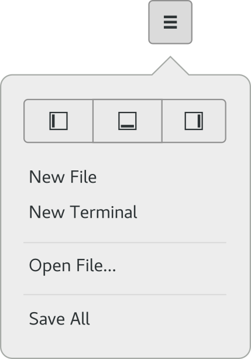

#######################
Exploring the Interface
#######################

The following sections will help you get to know a few aspects of Builder.

 * `Project Greeter`_
 * `Workbench Window`_
 * `Header Bar`_
 * `Switching Perspectives`_
 * `Showing and Hiding Panels`_
 * `Build your Project`_
 * `Preferences`_
 * `Command Bar`_

Project Greeter
===============

When you start Builder, you will be greeted by the following window.

.. image:: figures/greeter.png
   :width: 555 px
   :align: center

The window displays projects that were discovered on your system.
By default, the ``~/Projects`` directory will be scanned for projects on startup.
Projects you have previously opened will be shown at the top.

Selecting a project row opens the project.
Alternatively, start typing to search the projects followed by "Enter" to open.
Simply pressing "Enter" on startup will open your most-recently opened project.

If you'd like to remove a previously opened project, use the checkmark button in the top right to activate "selection mode".
Select the row you'd like to remove and then click "Delete" in the lower left corner of the window.

Workbench Window
================

The application window containing your project is called the "**Workbench Window**".
The workbench is split up into two main areas.
At the top is the `Header Bar`_ and beneath that is the current "**Perspective**".

Builder has many perspectives, such as the Editor, Build Preferences, Application Preferences, and the Profiler.

Header Bar
==========

Below shows the header bar.
This contains a button in the top-left for `Switching Perspectives`_.
In the center is the "OmniBar" which cna be used to `Build your Project`_.

To the right of the OmniBar is the Run button.
Clicking the arrow next to it allows you to change how Builder will run your application.
You can run normally, with a profiler, or Valgrind.

On the right is the search box.
Just type a few characters from the file you'd like to open and it will fuzzy search your project tree.
Use "Enter" to complete the request and open the file.

Right of the search box is the workbench menu.
You can find a few more options in here such as `Showing and Hiding Panels`_.

.. image:: figures/workbench.png
   :align: center

Switching Perspectives
======================

To switch perspectives, use the perspective selector button in the top-left of the workbench window.
Perspectives that support a keyboard accelerator will display the appropriate accelerator next to name of the perspective.

.. image:: figures/perspectives.png
   :width: 249 px

Select the row to change perspectives.

Showing and Hiding Panels
=========================

Sometimes panels get in the way of focusing on code.
You can move them out of the way using the workbench menu in the top-right.

Additionally, you can use the "left-visible", "right-visible", "bottom-visible" commands from the `Command Bar`_ to toggle their visibility.

Build your Project
==================

To build your project, use the OmniBar in the center of the header bar.
On the right of the OmniBar is a button for starting a build as shown in the image below.

.. image:: figures/omnibar.png
   :width: 495 px
   :align: center

Additionally, you can use the "build", "rebuild", or "clean" commands from the command bar.

While the project is building, the build button will change to a cancel button.
Clicking the cancel button will abort the current build.

.. image:: figures/building.png
   :width: 495 px
   :align: center

Preferences
===========

The preferences perspective allows you to change various preferences for Builder and plugins.
You can search for preferences using the keyword search in the top-left of the preferences perspective.

.. image:: figures/preferences.png
   :align: center

Command Bar
===========

The command bar provides a command-line-interface into Builder.
You can type various actions to activate them.
If Vim-mode is enabled, you can also activate some Vim-inspired commands here.

The command bar has tab completion which is shown below.

.. image:: figures/commandbar.png
   :align: center

