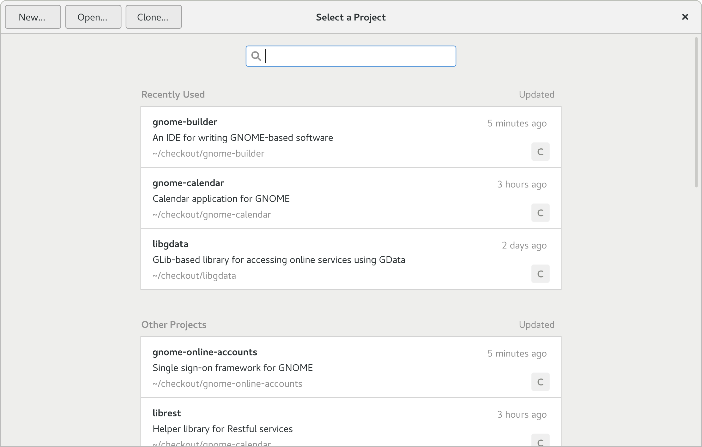
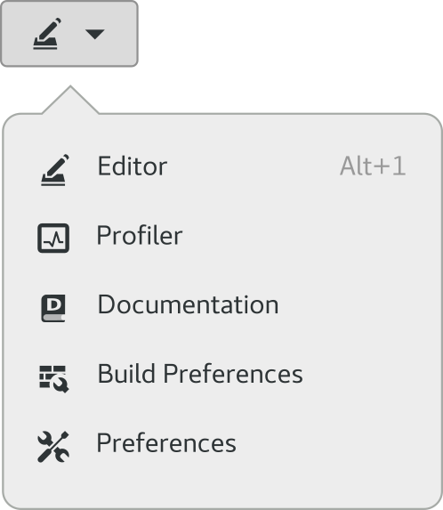
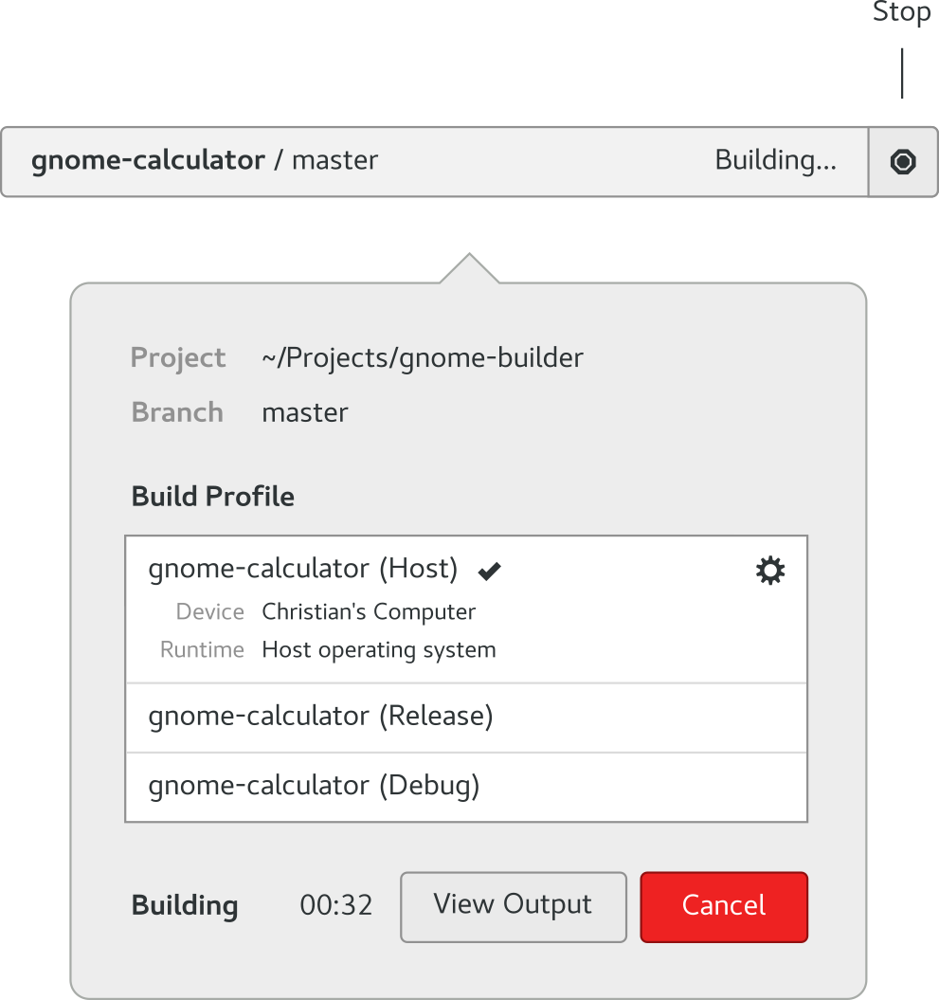
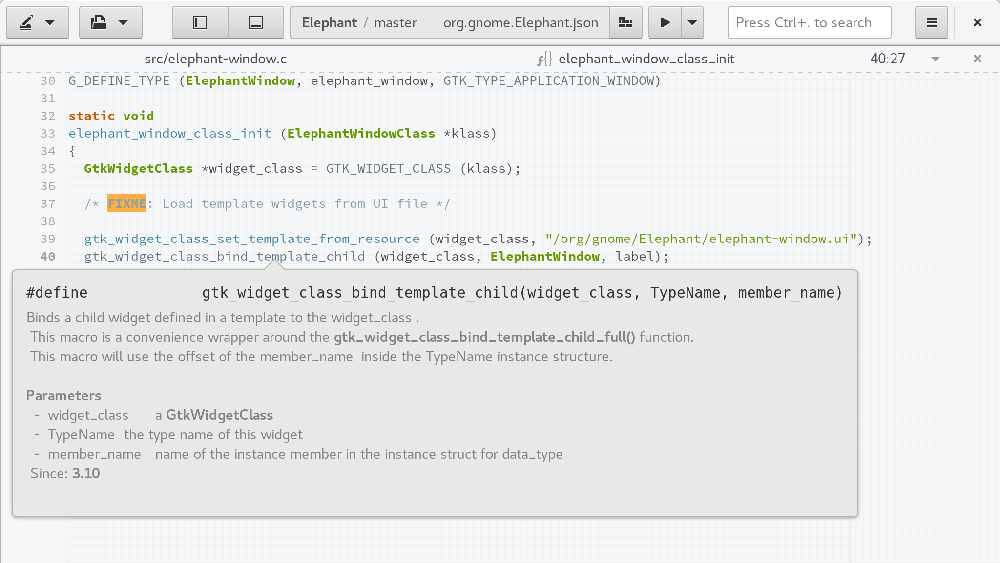
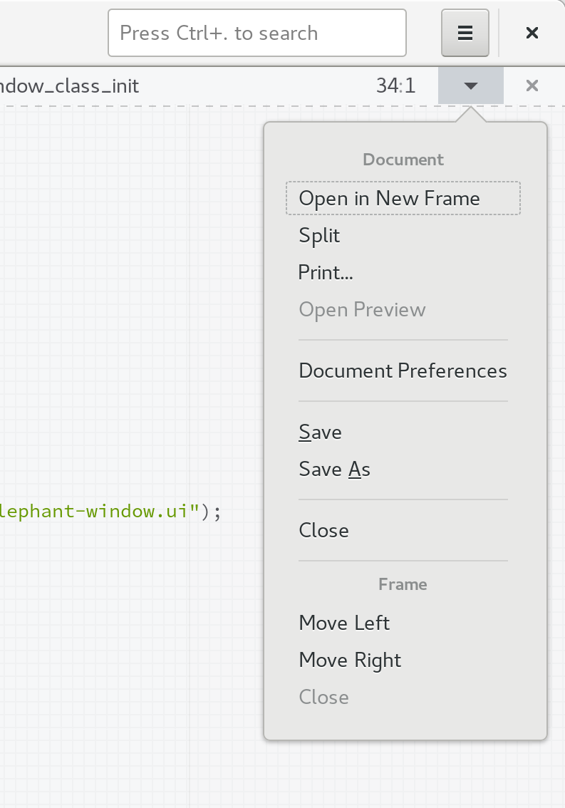
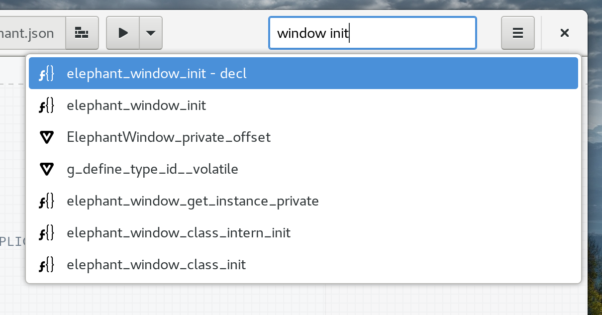
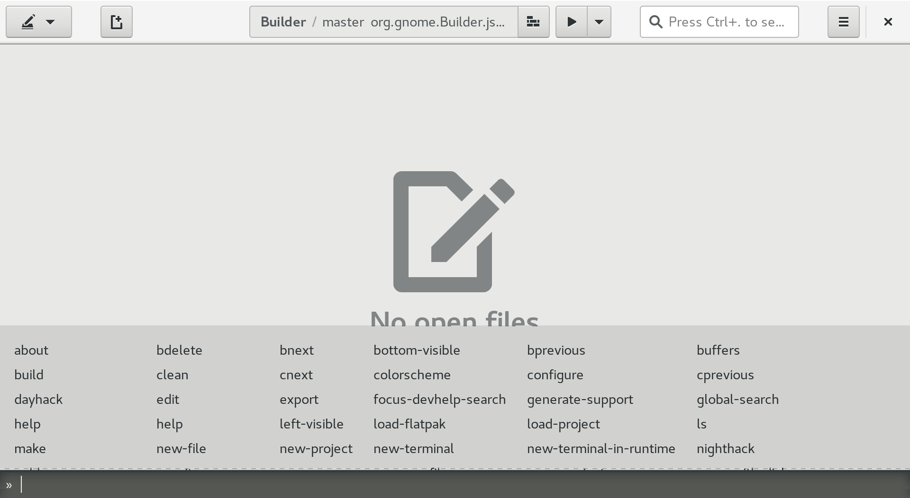
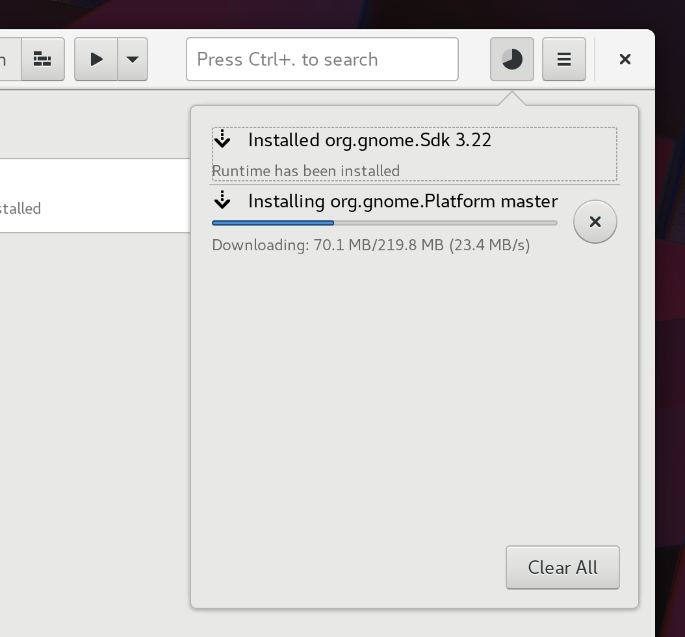

#######################
Exploring the Interface
#######################

The following sections will help you get to know Builder.

 * `Project Greeter`_
 * `Workbench Window`_
 * `Header Bar`_
 * `Switching Perspectives`_
 * `Showing and Hiding Panels`_
 * `Build your Project`_
 * `Editor`_
 * `Autocompletion`_
 * `Documentation`_
 * `Splitting Windows`_
 * `Searching`_
 * `Preferences`_
 * `Command Bar`_
 * `Transfers`_

Project Greeter
---------------

When you start Builder, you will be asked to select a project to be opened:

The window displays projects that were discovered on your system.
By default, the ``~/Projects`` directory will be scanned for projects when Builder starts.
Projects you have previously opened will be shown at the top.

Selecting a project row opens the project or pressing "Enter" will open the last project that was open.
You can also start typing to search the projects followed by "Enter" to open.

If you'd like to remove a previously opened project from the list, activate *Selection mode*.  
Press the "Select" button in the top right corner to the left of the close application button and
then select the row you would like to remove. 
Select the row(s) you'd like to remove and then click "Remove" in the lower left corner of the window.

Workbench Window
----------------

The application window containing your project is called the "**Workbench Window**".
The Workbench is split up into two main areas.
At the top is the `Header Bar`_ and below is the current "**Perspective**".

Builder has many perspectives, including the Editor, Build Preferences, Application Preferences, and the Profiler.

Header Bar
----------

The header bar is shown below.
This contains a button in the top left for `Switching Perspectives`_.
In the center is the "OmniBar" which can be used to `Build your Project`_.

.. image:: figures/workbench.png
   :align: center

To the right of the OmniBar is the *Run* button.
Clicking the arrow next to *Run* allows you to change how Builder will run your application.
You can run normally, with a debugger, profiler, or event with Valgrind.

On the right is the search box.
Type a few characters from the file you would like to open and it will fuzzy search your project tree.
Use "Enter" to complete the request and open the file.

To the right of the search box is the workbench menu.
You can find less-used features here.

Switching Perspectives
----------------------

To switch perspectives, click the perspective selector button in the top left of the workbench window.
Perspectives that support a keyboard accelerator will display the appropriate accelerator next to name of the perspective.

Select the row to change perspectives.

Showing and Hiding Panels
-------------------------

Sometimes panels get in the way of focusing on code.
You can move them out of the way using the buttons in the top left of the workbench window.

.. image:: figures/panels.png
   :width: 133 px
   :align: center

When entering Fullscreen mode, Builder will automatically dismiss the panels for your convenience.

Additionally, you can use the "left-visible" or "bottom-visible" commands from the `Command Bar`_ to toggle their visibility.

Build your Project
------------------

To build your project, use the OmniBar in the center of the header bar.
To the right of the OmniBar is a button for starting a build as shown in the image below.

.. image:: figures/omnibar.png
   :width: 708 px
   :align: center

You can also use the "build", "rebuild", "install", or "clean" commands from the command bar.

While the project is building, the build button will change to a cancel button.
Clicking the cancel button will abort the current build.

Editor
------

When Builder opens your project, it will place you in the editor perspective.
This is where you develop your project.

.. image:: figures/editor.png
   :width: 1415 px
   :align: center

Along the left is the project sidebar. It contains the project tre, list of
open documents, todo items, and build errors. Generally, it contains the
"source" or things to work on in your project.

Along the bottom is the utilities panel. Here you will find things like the
debugger, terminal, build, and application console.

Autocompletion
--------------

Builder has built-in support for various autocompletion engines.
Start typing to get word suggestions.

.. image:: figures/autocompletion.png
   :width: 960 px
   :align: center

Documentation
-------------

If you hover the pointer over API that Builder knows about, it can show you the documentation.
You can also use ``F2`` to bring up the documentation with your insertion cursor on the word.
Use ``Shift+K`` if you're using Vim keybindings.

Splitting Windows
-----------------

Builder can show you multiple editors side-by-side.
In the editor view use "Open in New Frame" to split a document into two views.

Afterwards, you'll see the editors side-by-side like such:

.. image:: figures/open-in-new-frame-2.png
   :width: 1122 px
   :align: center

To close a split, use the close button in the top right of the editor.

Searching
---------

You can search for files and symbols in your project using the search entry at the top right.
To focus the search entry with the keyboard use ``Control+.``.

You can fuzzy search for files by typing a few characters from the file name.

.. image:: figures/file-search.png
   :width: 629 px
   :align: center

Builder will automatically index your project into a database if it uses a supported language.
You can search this database to jump to code such as functions or classes.

Preferences
-----------

The preferences perspective allows you to change settings for Builder and its plugins.
You can search for preferences using the keyword search in the top left of the preferences perspective.

.. image:: figures/preferences.png
   :align: center

Command Bar
-----------

The command bar provides a command line interface into Builder.
You can type various actions to activate them.

To display the command bar, use the ``Control+Enter`` keyboard shortcut.
You can release the command bar by pressing ``Escape`` and return to the editor.

The command bar includes completion using ``Tab``, similar to the terminal.
Use this to explore the availble commands.

Transfers
---------

Sometimes it might be necessary for Builder to download content from the
internet to build your project. When this happens, you'll see a transfers
button displaying the progress in the top right.

