#######################
Exploring the Interface
#######################

The following sections will help you get to know Builder.

 * `Greeter`_
 * `Starting a New Project`_
 * `Workbench`_
 * `Workspace`_
 * `Header Bar`_
 * `Switching Surfaces`_
 * `Showing and Hiding Panels`_
 * `Build your Project`_
 * `Running`_
 * `Editor`_
 * `Autocompletion`_
 * `Documentation`_
 * `Splitting Pages`_
 * `Searching`_
 * `Preferences`_
 * `Command Bar`_
 * `Ongoing Tasks`_

Greeter
-------

When you start Builder, you will be asked to select a project to be opened:

.. image:: figures/greeter.png
   :width: 500 px
   :align: center

The greeter window will display projects that you have previously opened.
Additionally, it contains projects that you might be interested in contributing to.

Using the buttons at the bottom of the window, you may create a new project, select an existing project on disk, or clone a source code repository.

Selecting a project row opens the project.
Pressing "Enter" from the search box will open the first project matching the requested search text.

If you'd like to remove a previously opened project from the list, activate *Selection mode*.  
Press the "checkmark" button in the top right corner and then select the rows you would like to remove. 
Then click "Remove Projects" at the bottom of the window.

Starting a New Project
----------------------

Builder provides templates for a few kinds of projects.
From the `Greeter`_, select "Start New Project" and fill out the requested information.

.. image:: figures/start-new-project.png
   :width: 512 px
   :align: center

Click "Create Project" to get started.

Workbench
---------

A project "workbench" is a collection of windows used for your project.
For users with a single monitor, this is generally a single window.
But for multi-monitor users, multiple `Workspace`_ windows may be part of the same workbench.

Workspace
---------

The window containing your project is called a "**Workspace**".
A workspace contains the `Header Bar`_ and a number of **Surfaces**.

Builder has many surfaces, including the Editor, Build Preferences, and the Profiler.
Plugins may provide additional surfaces.

You can switch surfaces using the surface selector in the top-left of the `Header Bar`_.

Header Bar
----------

The header bar is at the top of the `Workspace`_.
This contains a button in the top-left for `Switching Surfaces`_.
In the center is the "Omni Bar" which can be used to `Build your Project`_.

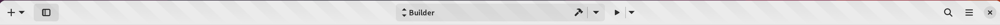

To the right of the Omni Bar is the *Run* button.
Clicking the arrow next to *Run* allows you to change how Builder will run your application.
You can run normally, with a debugger, profiler, or even with Valgrind.

On the right is the search box which you can focus with ``Control+.``.
Type a few characters from the file you would like to open and it will fuzzy search your project tree.
Use "Enter" to open the file.

To the right of the search box is the workspace menu.
You can find less-used items here.
If you are having an issue with Builder, you can use the "Generate Support Log" item to create a file which helps us troubleshoot your issue.

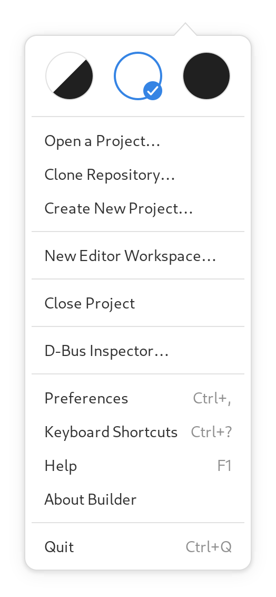

Switching Surfaces
------------------

To switch surfaces, click the perspective selector button in the top left of the workbench window.
Surfaces that support a keyboard accelerator will display the appropriate accelerator next to name of the perspective.

.. image:: figures/surfaces.png
   :width: 271 px
   :align: center

Select the row to change the surface.

Showing and Hiding Panels
-------------------------

Sometimes panels get in the way of focusing on code.
You can move them out of the way using the buttons in the top left of the workbench window.

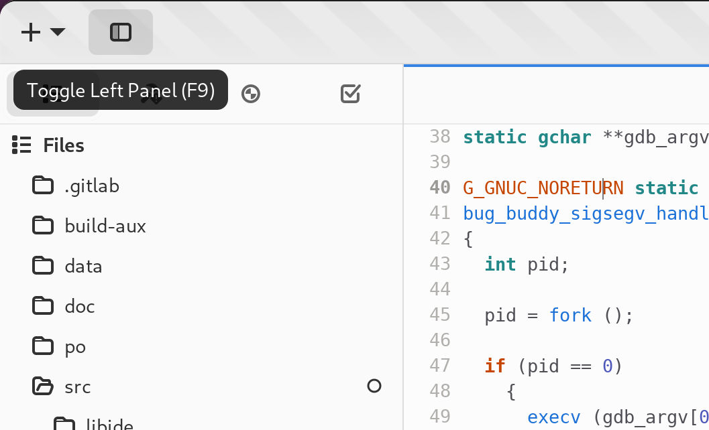

When entering Fullscreen mode, Builder will automatically dismiss the panels for your convenience.

Additionally, you can use the "left-visible" or "bottom-visible" commands from the `Command Bar`_ to toggle their visibility.

Build your Project
------------------

To build your project, use the OmniBar in the center of the header bar.
To the right of the OmniBar is a button for starting a build as shown in the image below.

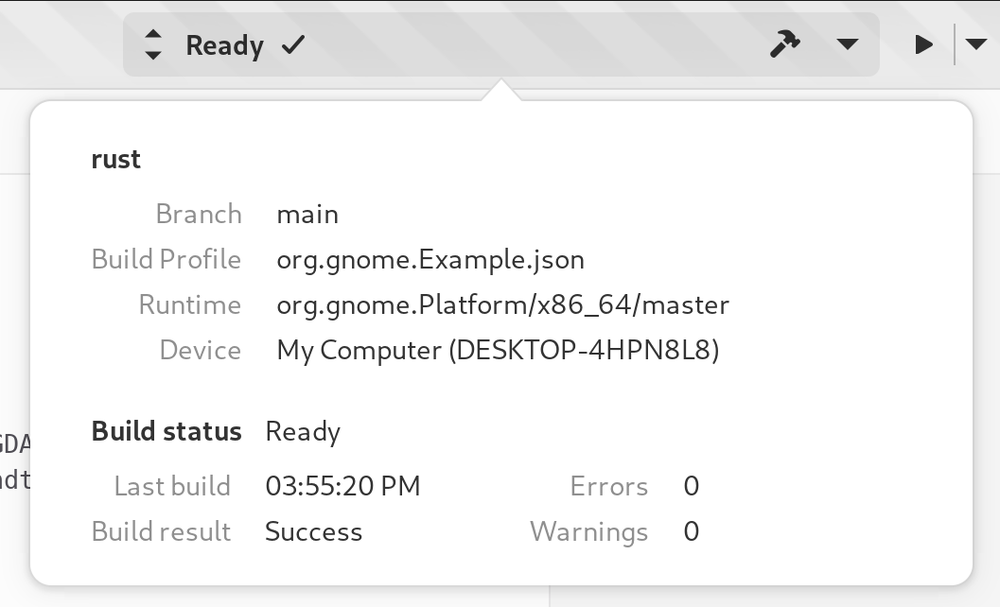

You can also use the "build", "rebuild", "install", or "clean" commands from the command bar.

While the project is building, the build button will change to a cancel button.
Clicking the cancel button will abort the current build.

Running
-------

Clicking the "Run" button in the `Header Bar`_ will ensure your application is built and then execute it within the selected runtime environment.
While the application is running, the "Run" button will change to a "Stop" button.
Clicking the "Stop" button will force the application to exit (usually with a ``SIGTERM``).

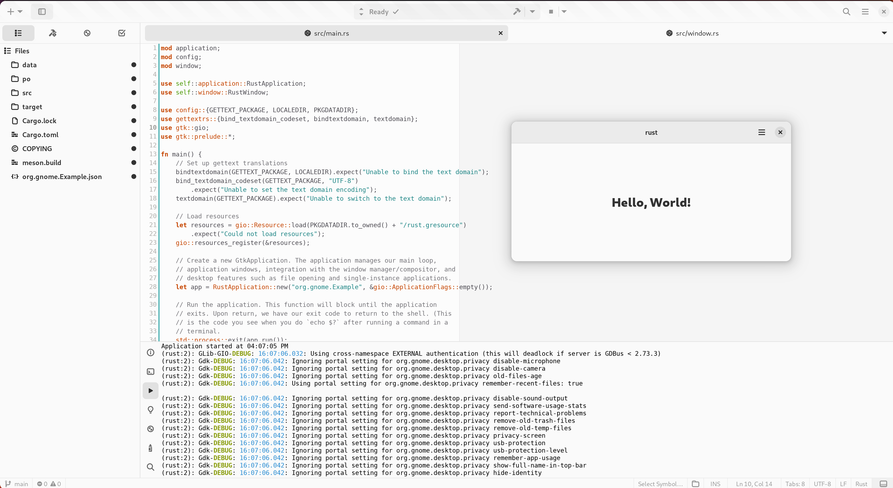

Editor
------

When Builder opens your project, it will place you in the editor perspective.
This is where you develop your project.

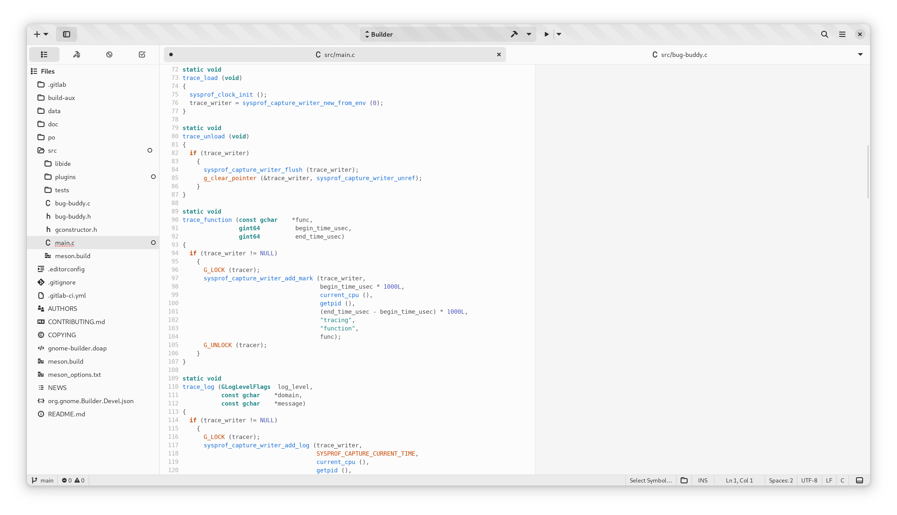

Along the left is the project sidebar. It contains the project tree, list of
open documents, todo items, and build errors. Generally, it contains the
"source" or things to work on in your project.

Along the bottom is the utilities panel. Here you will find things like the
debugger, terminal, build, and application console.

Overview Map
^^^^^^^^^^^^

You can enable the Overview Map from Preferences → Editor → Code Overview or using ``toggle-map`` command from the command bar.

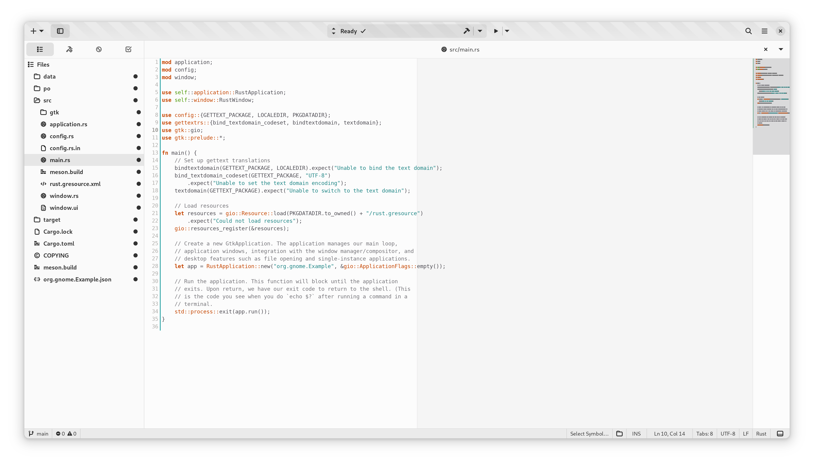

Autocompletion
--------------

Builder has built-in support for various autocompletion engines.
Start typing to get word suggestions.

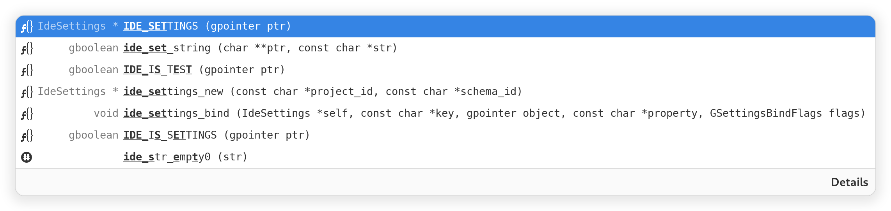

Documentation
-------------

If you hover the pointer over API that Builder knows about, it can show you the documentation.
You can also use ``F2`` to bring up the documentation with your insertion cursor on the word.
Use ``Shift+K`` if you're using Vim keybindings.

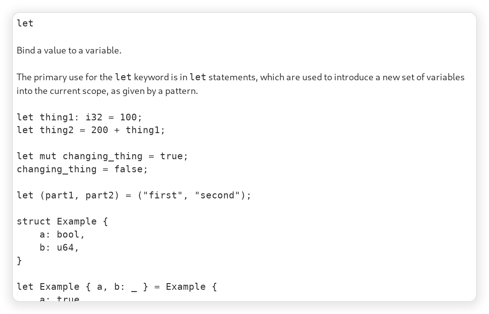

Splitting Pages
---------------

Builder can show you multiple editors side-by-side.
In the editor view use "Open in New Frame" to split a document into two views.

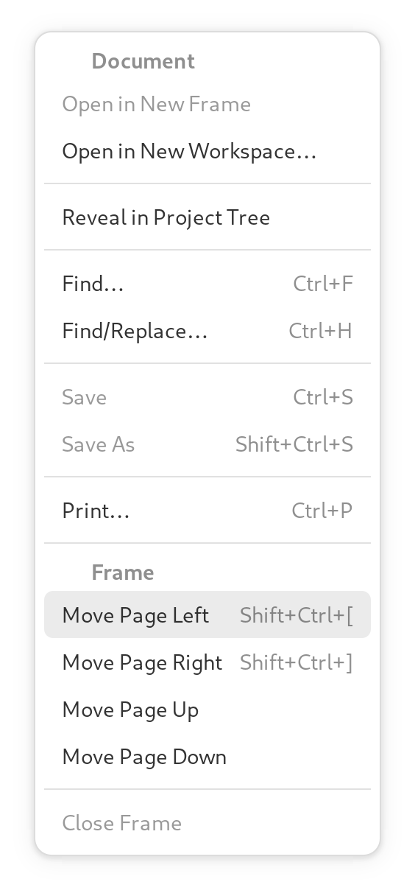

Afterwards, you'll see the editors side-by-side like such:

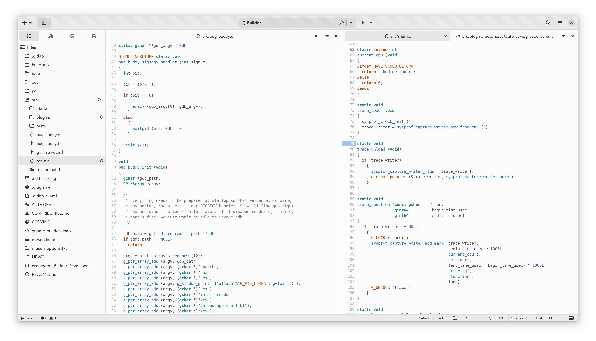

To close a split, use the close button in the top right of the editor.

Searching
---------

You can search for files and symbols in your project using the search entry at the top right.
To focus the search entry with the keyboard use ``Control+.``.

You can fuzzy search for files by typing a few characters from the file name.

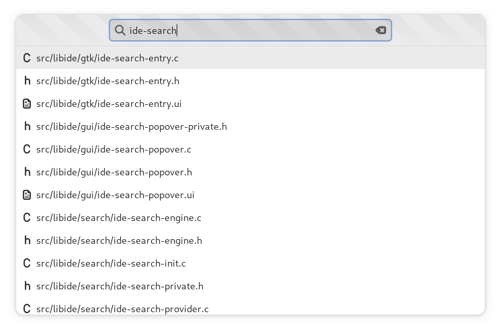

Builder will automatically index your project into a database if it uses a supported language.
You can search this database to jump to code such as functions or classes.

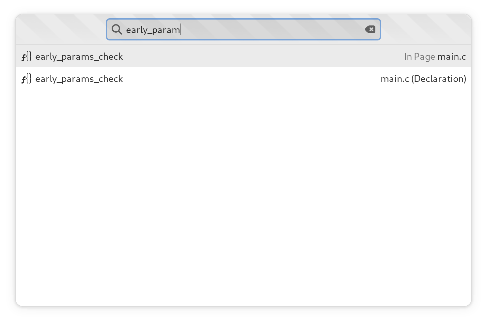

Preferences
-----------

The preferences perspective allows you to change settings for Builder and its plugins.
You can search for preferences using the keyword search in the top left of the preferences perspective.

.. image:: figures/preferences.png
   :align: center

Command Bar
-----------

The command bar provides a command line interface into Builder.
You can type various actions to activate them.

To display the command bar, use the ``Control+Enter`` keyboard shortcut.
You can release the command bar by pressing ``Escape`` and return to the editor.

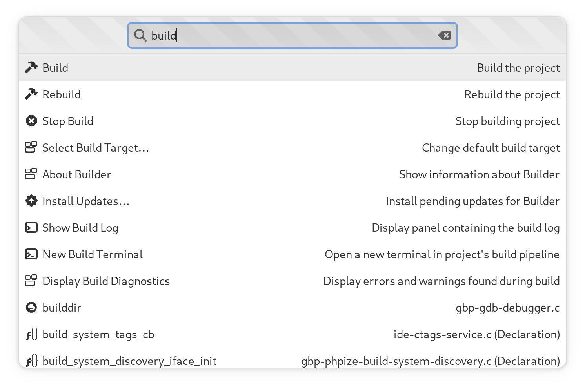

Ongoing Tasks
-------------

Sometimes it might be necessary for Builder to download content from the internet to build your project or perform other long-running tasks.
When this happens, a button is displayed with information about those operations.

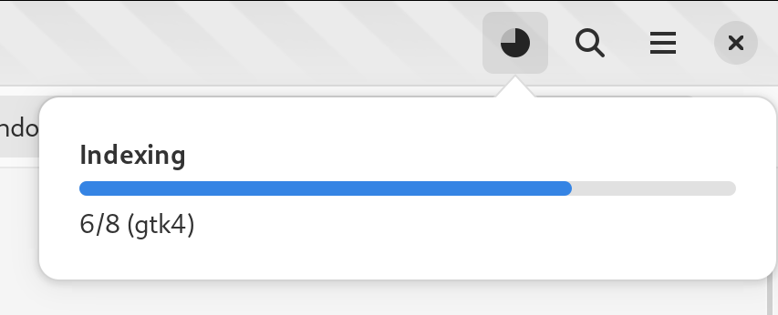

