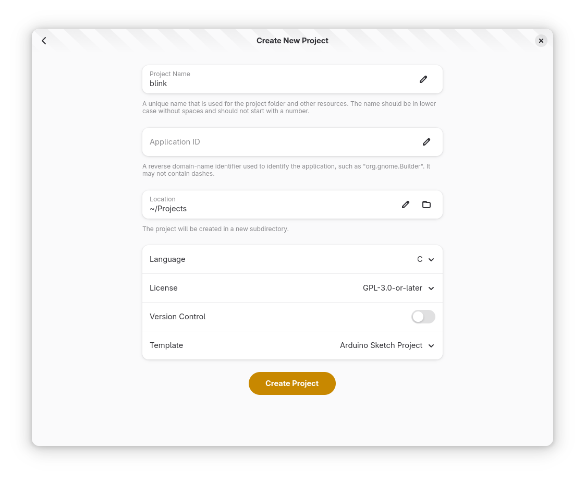
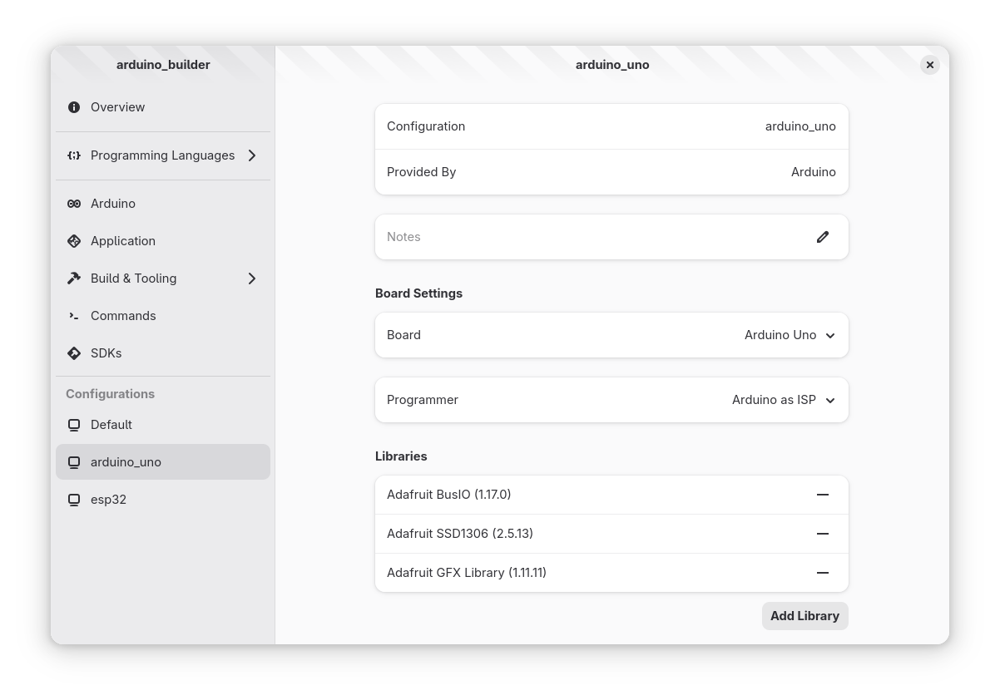
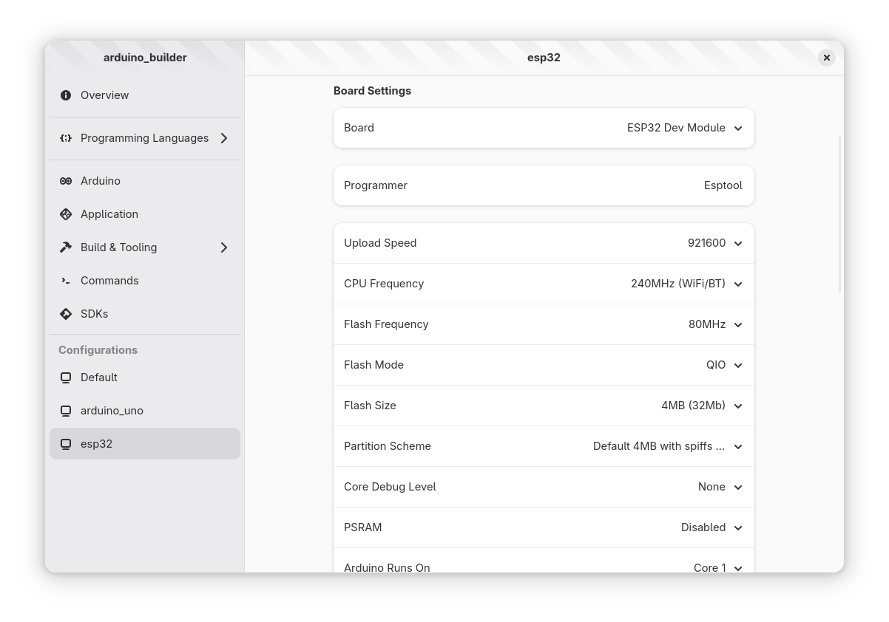
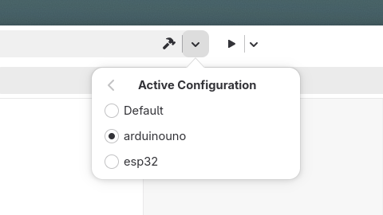
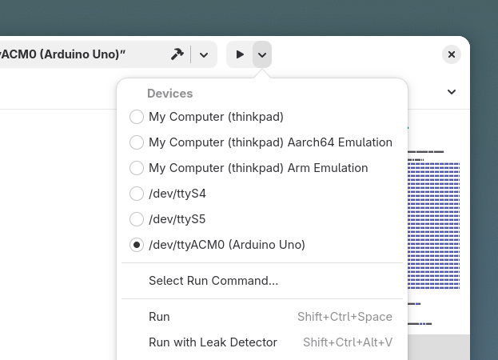
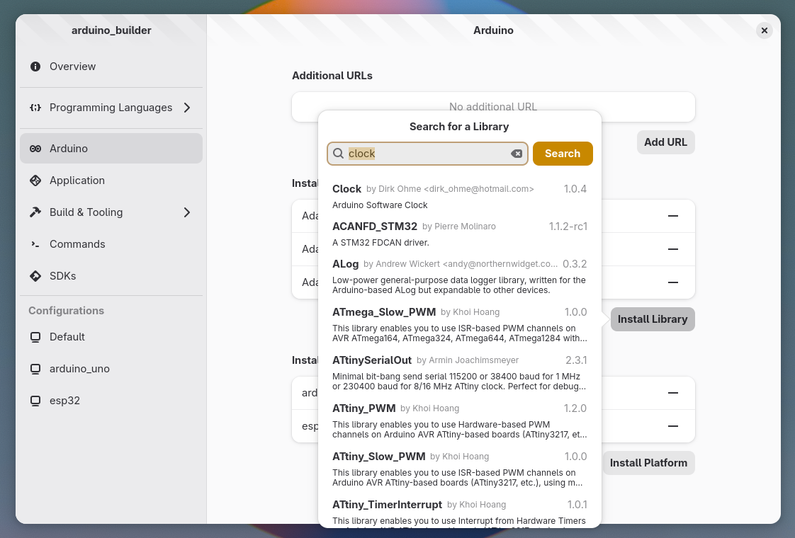

#######
Arduino
#######

The Arduino plugin for GNOME Builder provides seamless integration with ``arduino-cli``. This plugin allows you to develop, compile, and upload Arduino sketches directly from Builder's interface.

Prerequisites
=============

Before using the Arduino plugin, ensure you have ``arduino-cli`` installed on your system. Without this, the plugin will not function.

To install ``arduino-cli`` checkout the installation page_.

.. _page: https://arduino.github.io/arduino-cli/latest/installation/

Working with Arduino Projects
=============================

New Project
-----------

To easily start a new project you can use Builder's template for Arduino. An Arduino project is just a folder with a ``sketch.yaml`` (or ``sketch.yml``) and a ``*.ino`` file with the same name as the folder.

The **Application ID** entry can be left empty.

.. note::
   If you want to use Builder with an existing project make sure it has the same file structure.

Arduino Profiles
----------------

Profiles in ``arduino-cli`` are defined in a ``sketch.yaml`` file. Builder lets you configure and manage these profiles.

When you need to use a library in a project you will need to add it to the profile, same goes for platforms.

You can edit most profile preferences through Builder's UI:

Compiling Sketches
------------------

To compile an Arduino sketch:

1. Ensure you have selected the desired profile from the active configuration menu
2. Click the **Build Project** button in the OmniBar

Uploading Sketches
------------------

To upload your compiled sketch to an Arduino compatible board:

1. Select the target device from the devices menu
2. Click the **Run Project** button in the header bar

.. note::
   Selecting a device that is not compatible with Arduino will have no effect.

Managing Arduino Components
===========================

Installing Libraries and Platforms
----------------------------------

The plugin allows you to easily manage Arduino libraries and platforms:

1. Open the Preferences dialog
2. Navigate to the **Arduino** page
3. Use the search functionality to find platforms or libraries
4. Double click on the desired platform or library

All platforms and libraries installed through Builder are shared between ``arduino-cli`` and Arduino IDE 2.

Adding Additional Sources
-------------------------

For platforms not available in the standard Arduino index:

1. Go to the **Arduino** preferences page
2. Add the platform URL in the **Additional URLs** field
3. The new platforms will now appear in search results

Advanced Usage
==============

You can compile sketches using platforms or libraries not permanently installed on your system. The ``arduino-cli`` tool will download them temporarily. However, these components won't appear in the profile UI since only installed platforms and libraries are shown.

For some more advanced features not yet implemented in the Arduino plugin for GNOME Builder checkout ``arduino-cli``'s documentation_.

.. _documentation: https://arduino.github.io/arduino-cli

Troubleshooting
===============

If you have any issue uploading sketches you might need to fix port access on Linux following this article_.

.. _article: https://support.arduino.cc/hc/en-us/articles/360016495679-Fix-port-access-on-Linux