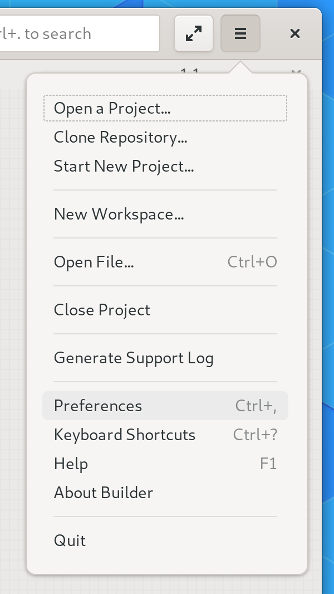
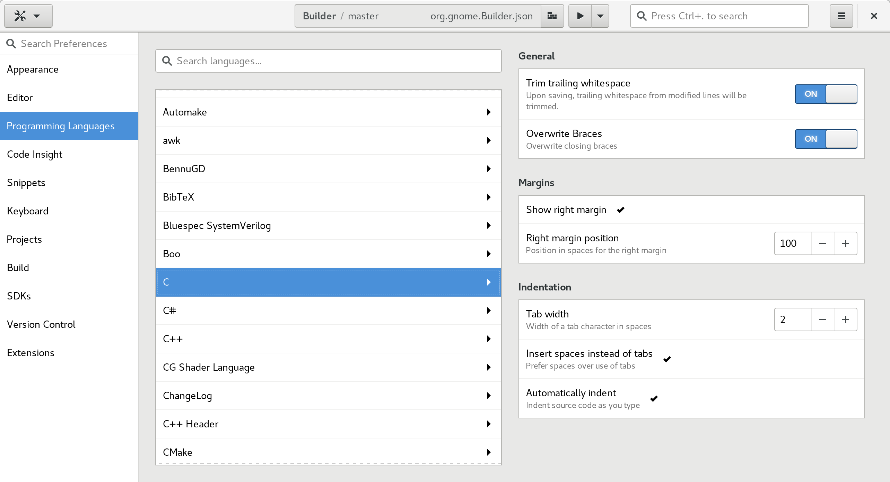
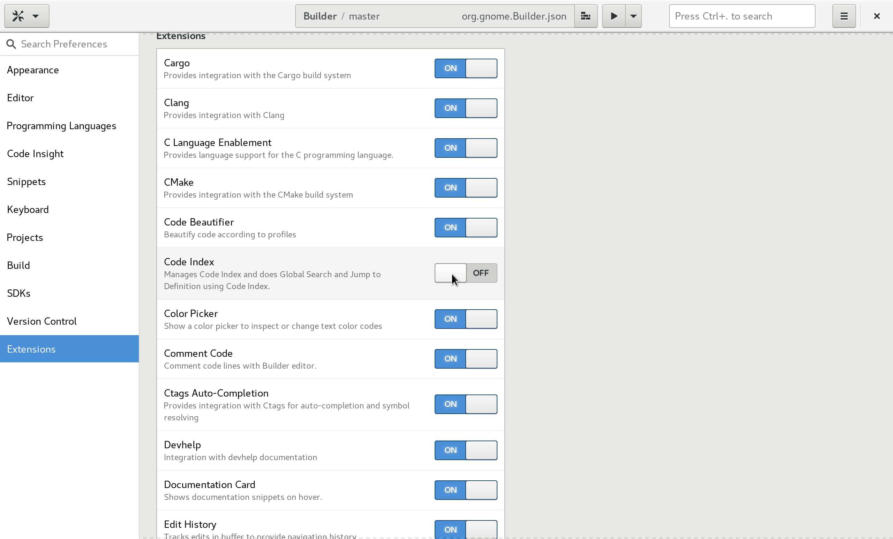

#################################
Enabling and Disabling Extensions
#################################

Builder is built to be extensible from the ground up.
In fact, many features of Builder are created as extensions.
To customize Builder for your workflow you may want to enable or disable some extensions.

To enable or disable an extension, open the application "Preferences" from the workspace menu.
You can also use the keyboard shortcut ``Control+,``.

You'll be presented with the preferences perspective which looks like:

Select "Extensions" from the menu on the left.
Then use the switches on the right to enable or disable an extension.

.. tip:: Use the search entry in the upper left to search for an extension

