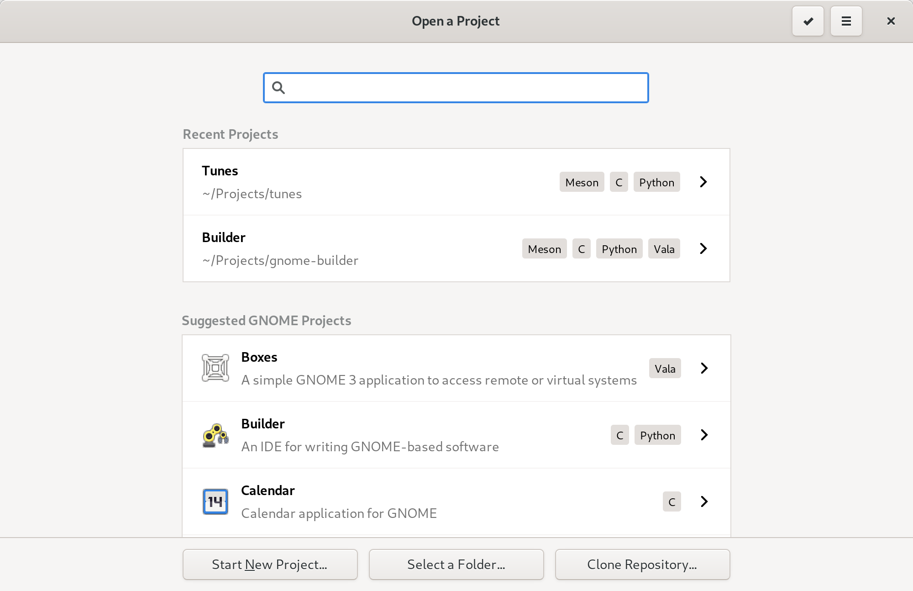

#####################
Extending the Greeter
#####################

When the user starts Builder, they are greeted by the ``Ide.GreeterWorkspace``.
This is a window containing a series of ``Ide.Surface``'s to display various options for opening a project.

In the following image, you can see the ``Ide.GreeterSurface`` showing personal projects as well as suggested new projects.
Along the bottom of the window are buttons providing various ways to open an existing project.

Adding a Surface
================

The ``Ide.Workspace`` API provides a method to add an additional ``Ide.Surface`` for your extension.

.. code-block:: python3

   class MyWorkspaceAddin(GObject.Object, Ide.WorkspaceAddin):

       def do_load(self, workspace):
           if type(workspace) != Ide.GreeterWorkspace:
               return

           my_surface = MySurface()
           workspace.add_surface(my_surface)
           workspace.set_visible_surface(my_surface)

Adding a Button
===============

You can add a button that switches to a custom surface, or even opens a dialog.

.. code-block:: python3

   # 'my-surface-name' should match the name of your widget (See Gtk.Widget.set_name())
   button = Gtk.Button(label='click me', visible=True, detailed_action_name='win.surface::my-surface-name')
   greeter_workspace.add_button(button, 100) # 100 is sort priority

Performing Long Running Actions
===============================

If you need to perform a long-running action, such as cloning a repository or expanding a template, then you should notify the workspace.
Surround your long running operation with calls to ``greeter_workspace.begin()`` and ``greeter_workspace.end()``.
This will cause the workspace to prevent certain changes by the user.

Adding Project Sections
=======================

The list of projects in the greeter are broken into sections.
You can add a section to the greeter using ``greeter_workspace.add_section()``.
The section should implement ``Ide.GreeterSection`` so that it can respond to user input and selections.

