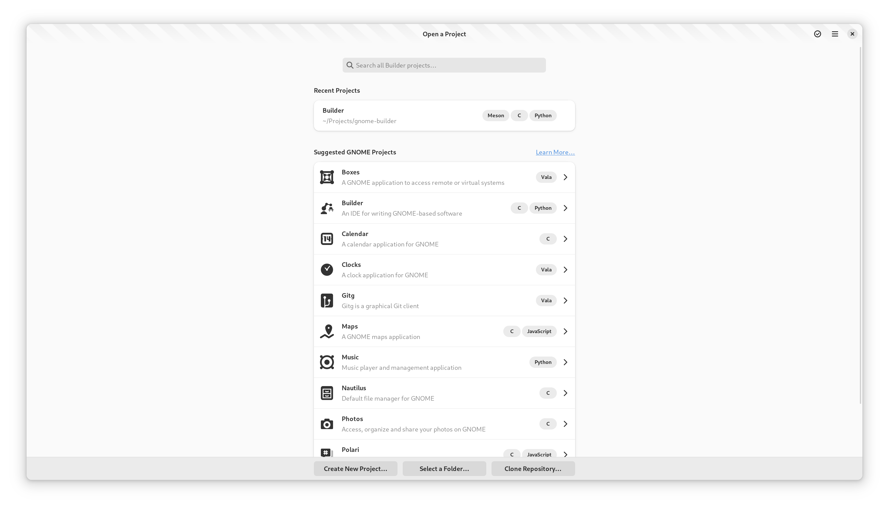

#####################
Extending the Greeter
#####################

The greeter is the view the user is presented with when starting Builder. In
the following image, you can see the various ways to create a new project in
the top left along with existing projects in the main content area.

Project Miners
==============

To add projects to the project list section of the greeter, you must implement
a project miner. You might want one of these if you would like to show projects
that are found through an external service such as gitlab or from mining the
users home directory.

To do this, we must implement an ``Ide.ProjectMiner`` which emits the
``Ide.ProjectMiner::discovered()`` signal when a project has been discovered.

.. code-block:: python3

   # my_plugin.py

   import gi

   from gi.repository import GObject
   from gi.repository import Gio
   from gi.repository import Ide

   class MyProjectMiner(GObject.Object, Ide.ProjectMiner):

       def do_mine_async(self, cancellable, callback, data):
           task = Gio.Task.new(self, cancellable, callback)

           # ... Now run your discovery code.

           info = Ide.ProjectInfo()
           info.set_name('Secret Project')
           info.set_file(Gio.File.new_for_path('Projects/.secret_project'))
           info.set_languages(['C', 'Python'])

           # If you set the project as recent, it will show up in the upper
           # section rather than "Other Projects"
           info.set_is_recent(True)

           # See libide/projects/ide-project-info.h for more options you
           # can provide on the Ide.ProjectInfo.

           # Now notify of the discovered info.
           self.emit_discovered(info)

           task.return_boolean(True)

       def do_mine_finish(self, task):
           return task.propagate_boolean()

Project Creation Workflows
==========================

You can add a new button to the project creation bar using an ``Ide.GenesisAddin``.

.. note:: Adding buttons to the project creation section does not scale well.
          If you really think you need something here, talk to our designers so
          that we can accomidate a new design for your use case.

It is also possible to add a project creation workflow without adding a button
to the headerbar. Some plugins such as flatpak use this to clone sources via a
hidden ``gnome-builder`` command line switch.

.. code-block:: python3

   # my_plugin.py

   import gi

   from gi.repository import GObject
   from gi.repository import Gio
   from gi.repository import Gtk
   from gi.repository import Ide

   class MyGenisisAddin(GObject.Object, Ide.GenesisAddin):
       widget = None

       def do_get_title(self, application):
           return "Magic Wand"

       def do_get_label(self, application):
           return "Magic Wand"

       def do_get_widget(self, application):
           if not self.widget:
               self.widget = Gtk.Label(label='My New Genesis Addin', visible=True)
           return self.widget

       def do_get_priority(self):
           # for positioning within the buttons
           return 100

       def do_run_async(self, cancellable, callback, data):
           task = Gio.Task.new(self, cancellable, callback)
           # Do async project creation, and then open project.
           task.return_boolean(True)

       def do_run_finish(self, task):
           return task.propagate_boolean()
