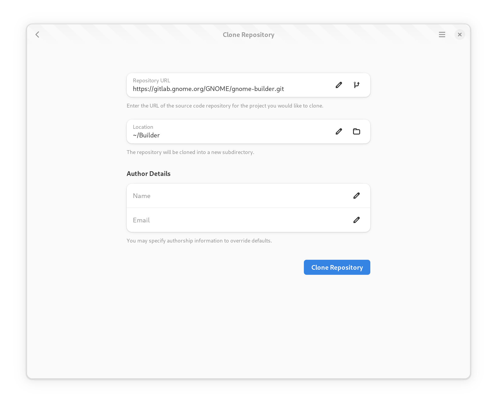

.. _`GPLv3`: http://www.gnu.org/licenses/gpl-3.0.html

###############################
Creating and Importing Projects
###############################

Builder supports creating new projects and importing existing projects.
When importing a project, you can either open it from your local computer or
clone it from a remote git repository.

Creating a new Project
======================

To create a new project, select "New" from the project greeter.
The project creation guide will be displayed.

.. image:: ../figures/start-new-project.png
   :width: 512 px
   :align: center

Give your project a meaningful name, as this is not easily changeable later.
The project name should not include spaces and if the project needs
multiple words, use a hyphen "-" to separate the words.

Choose the language you would like to use for the project.
Depending on the language, different templates are available.

Choosing a license helps promote sharing of your application.
Builder is licensed as **GPLv3 or newer** and we suggest using `GPLv3`_ when
writing new applications for GNOME.

If you do not want git-based version control, turn off the switch to disable
git support.

Lastly, select a suitable template for your application.
Some patterns are available to speed up the bootstrapping of your project.

Cloning an Existing Project
===========================

To clone an existing project, you will need the URL of your **git repository**.
For example, to clone the Builder project, you could specify: ``https://gitlab.gnome.org/GNOME/gnome-builder.git``.

After entering the URL, press the "Clone" button and wait for the operation to complete.
You'll be provided progress updates during the operation.
Once the project has been cloned, a new workspace window will be opened for the project.

.. note:: If the remote repository requires authorization a dialog will be displayed for you to input your credentials.
