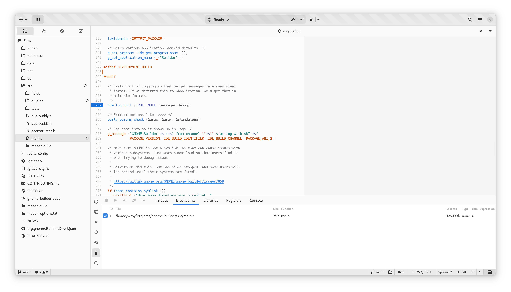

######################
Debugging your Project
######################

Builder provides a debugger interface which can be extended for various languages.
Currently, there is support for the GNU Debugger which supports C, C++, and to some degree Rust, and Vala.

To start the debugger, select "Run with Debugger" from the Run button.

.. image:: ../figures/run-button.png
   :width: 297 px
   :align: center

.. warning:: If Builder fails to locate a debugger that is compatible with your project, an error message will be displayed.

After Builder has started the debugger, you'll be greeted with a series of controls to step through your application.

.. note:: The debugger support in Builder is currently limited, and will be expanded in future releases.

You can currently do a few things with the debugger in Builder.

 - Step through execution in a variety of fashions
 - Browse threads and thread stacks
 - Explore current register values
 - View the values of locals and parameters
 - Add and remove breakpoints to aid in stepping through execution
 - View disassembly when no source is available

