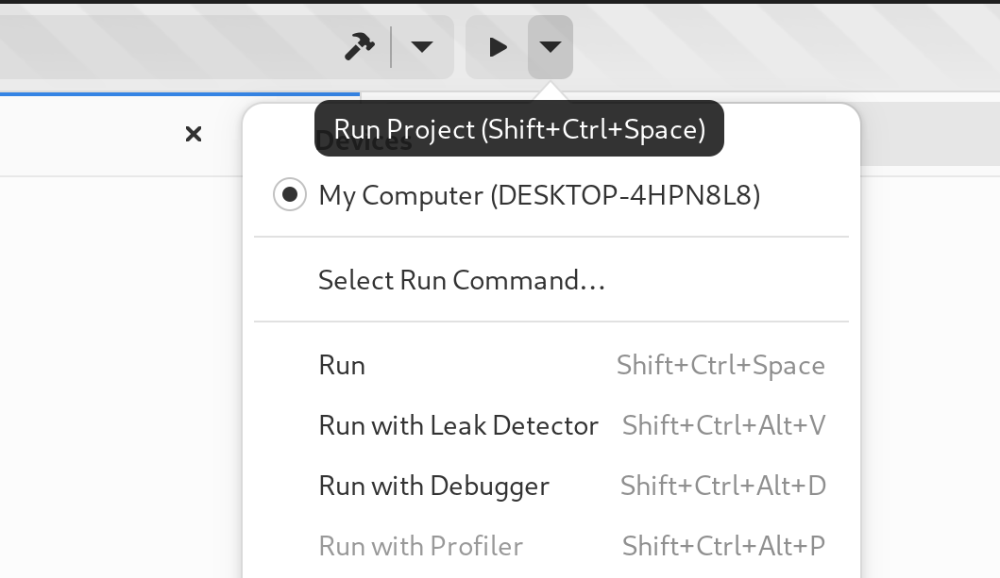

######################
Profiling your Project
######################

Builder integrates with the Sysprof profiler to provide a robust sampling profiler.

Select "Run with Profiler" from the run button.

While the application is running, you'll see a screen like this indicating that Sysprof is recording CPU samples on your system.

.. image:: ../figures/profiler-running.png
   :align: center

After stopping or exiting your program, you will be presented with a callgraph like the following.
You can select a time range within the CPU visualizer to limit the callgraph to samples recorded witin the selection.

.. image:: ../figures/profiler-callgraph.png
   :align: center

