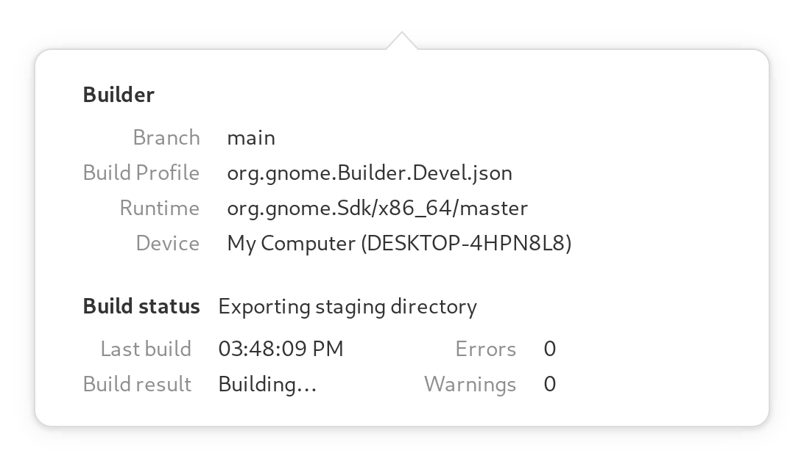
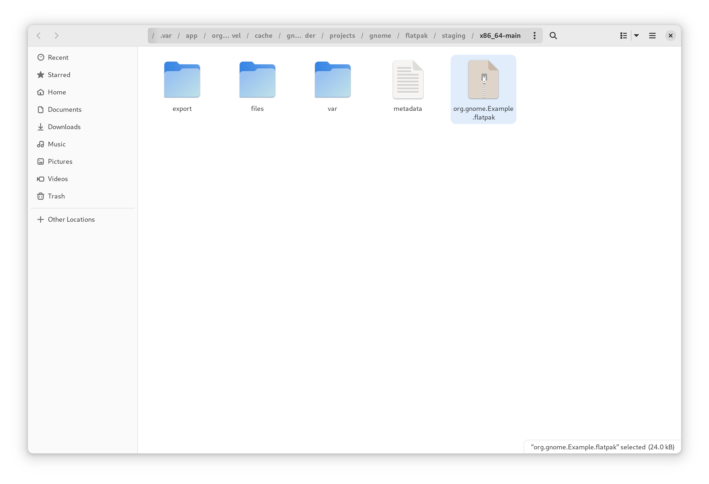

####################
Sharing your Project
####################

By default the application templates in Builder will use Flatpak.
This makes it easy to bundle your project and share it with a friend.

When using Flatpak, you can click the "Export Bundle" button in the build popover.

At this point Builder will build and install your project using the Flatpak build tooling.
After it completes, Files will open the build directory to reveal your new flatpak.
This can be opened with Software to install on your or a friends system.

