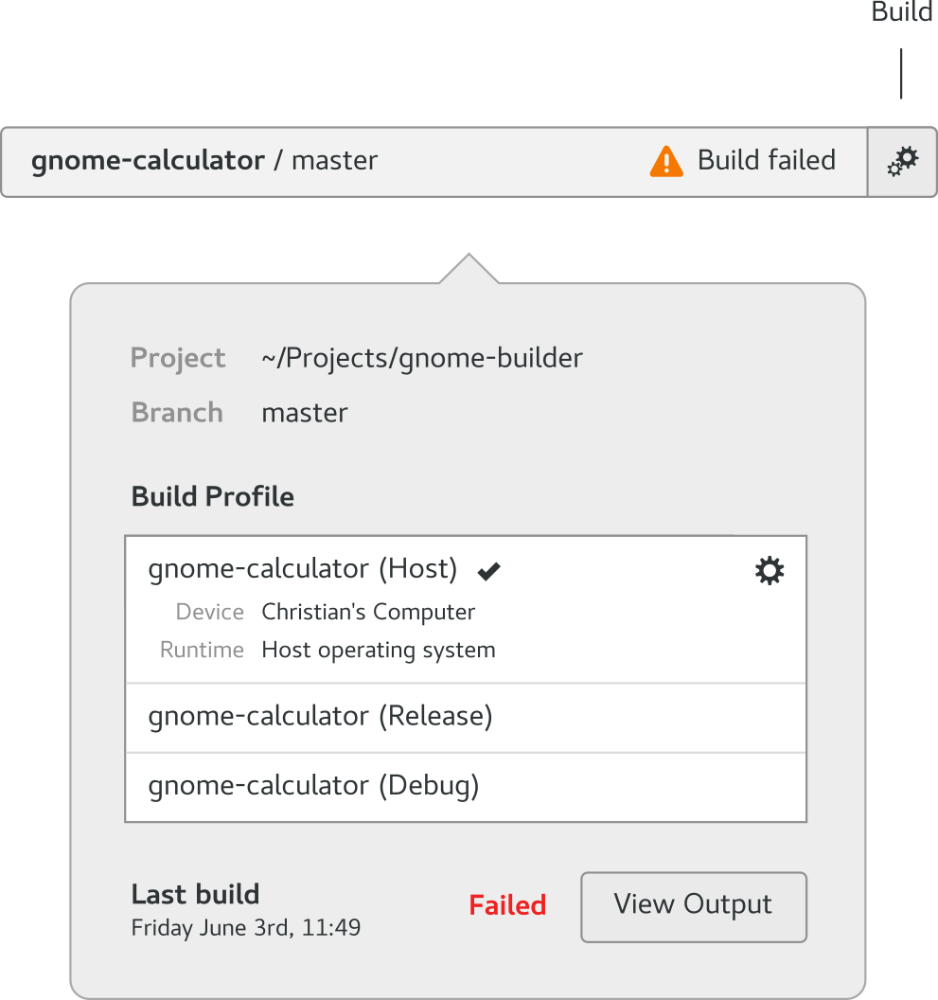

#####################
Building your Project
#####################

There are multiple ways to activate a build for your project:

* Press the Build Button on the right of the OmniBar as shown in the figure below
* Press the ``Control`` and ``F7`` keys together
* Activate the command bar at the bottom of the Builder window by pressing ``Control`` and ``Enter`` and typing "build" followed by the ``Enter`` key
* Click the OmniBar and press the Build button in the lower-left corner of the dialog window

